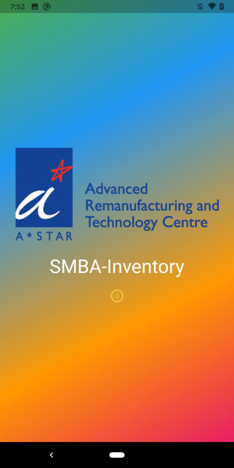
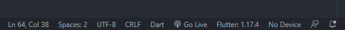

# Inventory App

This is one of the four apps in the **Smart Manufacturing Business Apps (S.M.B.A)** project. 

This app will be used to manage and track the items in the depository. It can also be integrated with the **CRM & Sales App**. In this case, it will check whether there are enough number of required components in store, and send notifications if not when a *purchase order* is placed for certain products.

## Getting Started

This app was developed in **Visual Studio Code** with **Flutter**. 

### Prerequisites

- Download the Flutter SDK
- For Android version development
    - Install the Android SDK
    - Set up your Android device or Android emulator
- For iOS version development
    - Install Xcode
    - Set up the iOS simulator
- Install Visual Studio Code
    - Install the Flutter and Dart plugins

## Build the app

1. Locate the VS Code status bar (the blue bar at the bottom of the window):

2. Select a device from the Device Selector area.
    - If no device is available and you want to use a device simulator, click **No Devices** and launch a simulator.
3. Invoke **Run > Start** Debugging or press F5.
4. Wait for the app to launch — progress is printed in the Debug Console view.

## Built With

* [Flutter](https://flutter.dev) - The UI toolkit used
* [Dart](https://dart.dev/) - The programming language used
